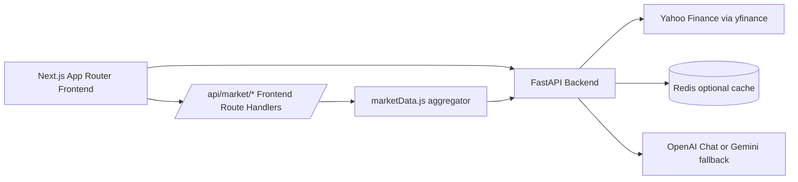
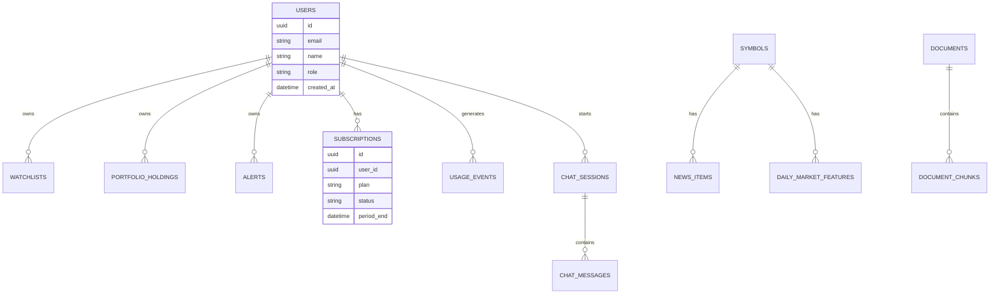

# StockSense AI Platform Audit and Upgrade Report

Date: 2026-06-24

## 1) Audit Scope Completed
- Frontend source files audited in `stocksense-frontend/app`, `stocksense-frontend/lib/server`, and API routes.
- Backend source files audited in `stocksense-backend-openai/app`, tests, and runtime config.
- API routes mapped end to end.
- Duplicate logic, unused paths, security gaps, performance gaps, and missing enterprise features identified.

## 2) Current Architecture Diagram

## 3) Backend API Map
- `GET /` service metadata and endpoint list.
- `GET /health` service health.
- `GET /stocks/{symbol}` quote and fundamentals.
- `GET /stocks/{symbol}/news` latest news items.
- `GET /stocks/{symbol}/history?period=...` OHLCV candles plus indicators.
- `GET /stocks/{symbol}/insights` bull score, bear score, confidence, drivers, factors, sentiment trend.
- `POST /chat/` non-streaming AI response.
- `POST /chat/stream` streaming AI response.

## 4) Frontend Component Map
- `app/page.js`
- Hero + ticker + dashboard cards.
- News intelligence panel with gauge and timeline.
- Full-width terminal workspace.
- Left sticky research panel.
- Center live chart + chat.
- Right sticky dynamic question bank.
- Resizable column handles.
- Keyboard shortcuts and command palette.

## 5) Key Findings from Audit

### Critical
- Auth is not real yet: profile route is header-based placeholder and not backed by identity provider/JWT.
- No persistent DB layer for watchlists, portfolio, billing, usage, or alerts.
- No billing integration (Stripe absent).
- No RBAC/authorization policy.

### High
- No production RAG service wired into chat path.
- Security middleware hardening not complete (helmet equivalent headers, CSRF strategy, audit logs).
- Rate limiting and quota enforcement not implemented.
- Observability stack not implemented (Sentry/OpenTelemetry/Grafana).

### Medium
- Frontend still monolithic in `app/page.js`; should be split into modular components.
- No dedicated global market treemap implementation.
- Accessibility baseline improved by semantics but no full WCAG 2.1 AA pass yet.

## 6) Duplicate and Unused Logic Findings
- Duplicate sanitization patterns exist in frontend API routes for user handling.
- Legacy README references outdated provider assumptions and architecture notes.
- `rag_service.py` exists as standalone workflow but is not integrated into runtime APIs.

## 7) Security Report (Current State)
- Positive:
  - Symbol and user query sanitization exists in frontend route handlers.
  - CORS allowlist is present in backend.
- Gaps:
  - No JWT auth validation.
  - No per-user authorization checks.
  - No rate limit middleware.
  - No CSRF strategy for future cookie-based auth.
  - No audit/event logging for sensitive actions.

## 8) Performance Report (Current State)
- Positive:
  - Redis cache layer for quotes/news/history.
  - Frontend server-side cache helper for market route aggregation.
- Gaps:
  - Frontend page component is large and can trigger broad rerenders.
  - No CDN/media strategy for enterprise chart datasets.
  - No backend query profiling/latency SLO tracking.

## 9) Accessibility Report (Current State)
- Positive:
  - Inputs and interactive controls have base labels/roles.
  - Keyboard shortcuts added for power users.
- Gaps:
  - Full focus order and visible focus styling audit needed.
  - Color contrast checks not formally validated.
  - Screen reader announcement patterns for streaming chat not yet implemented.

## 10) Changes Executed in This Upgrade Pass

### Workspace and UX
- Converted AI workspace to full-width terminal style layout.
- Added sticky side panels and larger center chat + chart area.
- Added draggable resize handles for left and right columns.
- Reduced empty spacing and improved desktop/tablet/mobile responsiveness.

### Dynamic Bull/Bear Engine
- Added backend `GET /stocks/{symbol}/insights` for any symbol.
- Bull/Bear scores now computed from:
  - News sentiment
  - Social sentiment proxy
  - Price momentum
  - Analyst-quality proxy
  - Volume behavior
  - Relative strength
- Added confidence scoring and driver explanations.
- Added frontend gauge and sentiment trend rendering for active symbol.

### Real Charting Data
- Upgraded history payload to OHLCV candles.
- Added backend indicator calculations:
  - SMA
  - EMA
  - RSI
  - MACD
  - Bollinger Bands
- Added frontend candlestick + volume chart rendering with indicator overlays.
- Added timeframe controls: `1D`, `1W`, `1M`, `3M`, `6M`, `1Y`, `5Y`.

### Keyboard Productivity
- Implemented shortcuts:
  - `/` focus symbol search
  - `Ctrl+K` toggle command palette
  - `Ctrl+Enter` send chat
  - `Alt+1` Dashboard
  - `Alt+2` News
  - `Alt+3` Workspace
  - `Alt+4` Social
  - `Esc` close command palette

### Identity Flow Improvement
- Removed local-storage name editing workflow.
- Added `GET /api/user/profile` route and frontend profile fetch path.
- This is a transition step toward real auth integration.

## 11) Database Schema (Target)

## 12) Deployment Guide (Target)
- Frontend: Vercel.
- Backend: Fly.io or AWS ECS with autoscaling.
- DB: PostgreSQL.
- Cache: Redis.
- Queue: BullMQ worker tier for ingestion/jobs.
- Storage: S3.
- Monitoring: Sentry + OpenTelemetry + Grafana.
- CI/CD: GitHub Actions with environments `dev`, `staging`, `prod`.

## 13) Technical Debt Remaining
- Break `app/page.js` into composable modules.
- Replace profile stub with real authentication and session validation.
- Integrate RAG service into runtime chat endpoints.
- Add production observability and SLO alerting.
- Implement full SaaS billing and quota enforcement.
- Add full treemap and institutional market breadth widgets.

## 14) 90-Day Roadmap
- Days 1-30:
  - Auth, JWT middleware, user/portfolio/watchlist persistence.
  - Rate limiting, security headers, audit logs.
  - Stripe subscriptions and usage metering.
- Days 31-60:
  - Production RAG ingestion pipeline and citations in chat.
  - Treemap engine and institutional flow widgets.
  - Modular frontend refactor and accessibility hardening.
- Days 61-90:
  - Observability stack and error budgets.
  - Multi-region deployment hardening.
  - Team features for institutional tier (seats, shared workspaces, API keys).
