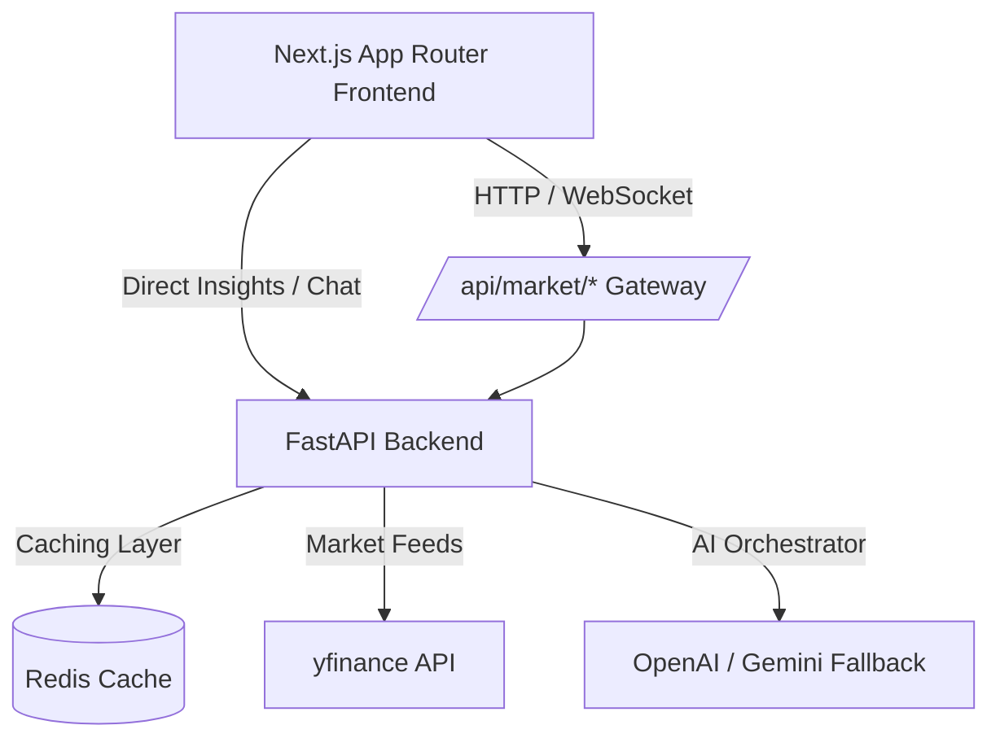

# StockSense AI — Intelligent Financial Workstation

StockSense AI is a high-performance, developer-centric financial intelligence workstation. It bridges modern AI capabilities with quantitative technical analysis, allowing investors and analysts to conduct multi-dimensional asset research. 

The platform aggregates real-time market data, calculates key technical indicators, runs news/social sentiment heuristics, and serves a streaming chat assistant for contextual research.

---

## 🏗️ Architecture Overview

The system utilizes a split-tier architecture: a high-concurrency **FastAPI backend** running technical indicators and sentiment heuristics, and a responsive **Next.js App Router frontend** optimized for live charting and hotkey workflows.



---

## 🚀 Key Features

* **⚡ Real-time Market Data & Caching**: Integrates with financial feeds to pull real-time quotes, fundamentals, historical data, and news, cached via a Redis layer for sub-millisecond response rates.
* **📈 Built-in Quantitative Analytics**: Programmatically calculates key indicators directly from raw OHLCV candles, including:
  * Simple Moving Average (SMA) & Exponential Moving Average (EMA)
  * Relative Strength Index (RSI)
  * Moving Average Convergence Divergence (MACD)
  * Bollinger Bands
* **📊 Sentiment & Heuristic Engine**: Features a custom-weighted *Bull/Bear Sentiment Engine* aggregating:
  * Active news article sentiment
  * Social volume momentum proxy
  * Price and trading volume velocity
  * Analyst recommendation ratings
* **💬 Streaming Conversational Workspace**: A split-screen terminal layout featuring a low-latency streaming chat interface driven by OpenAI with automatic fallback to Gemini models.
* **🎹 Keyboard-Centric UX**: Engineered for efficiency with hotkeys:
  * `/` to focus symbol search
  * `Ctrl + K` to open the Command Palette
  * `Ctrl + Enter` to send chat queries
  * `Alt + 1` / `Alt + 2` / `Alt + 3` / `Alt + 4` to toggle workspace views

---

## 🛠️ Tech Stack

* **Frontend**: Next.js 14+ (App Router), Tailwind CSS, Recharts (Responsive Candlesticks), Lucide Icons
* **Backend**: FastAPI (Python 3.11+), Uvicorn, SQLite (Database), Redis (Caching)
* **Libraries**: `yfinance` (market data), `pandas` (data frames), `scikit-learn` (quantitative modeling), `pydantic` (validation)

---

## 🏁 Getting Started

### 1. Backend Setup
1. Navigate to the backend directory:
   ```bash
   cd stocksense-backend
   ```
2. Create and activate a virtual environment:
   ```bash
   python -m venv venv
   source venv/bin/activate  # On Windows: venv\Scripts\activate
   ```
3. Install dependencies:
   ```bash
   pip install -r requirements.txt
   ```
4. Create a `.env` file in the backend root and define your API keys:
   ```env
   OPENAI_API_KEY=your_openai_key
   GEMINI_API_KEY=your_gemini_key
   ```
5. Start the FastAPI server:
   ```bash
   uvicorn app.main:app --reload
   ```

### 2. Frontend Setup
1. Navigate to the frontend directory:
   ```bash
   cd stocksense-frontend
   ```
2. Install Node dependencies:
   ```bash
   npm install
   ```
3. Start the Next.js development server:
   ```bash
   npm run dev
   ```
4. Open [http://localhost:3000](http://localhost:3000) in your browser.

---

## 🛣️ 90-Day Enterprise Roadmap

* **Security & Auth**: Migrate the stub profile system to a robust JWT / OAuth2 system backed by Supabase or Auth0.
* **Retrieval-Augmented Generation (RAG)**: Wire the offline `rag_service.py` directly into the runtime API chat path, enabling users to upload personal portfolio documents and corporate PDFs for inline AI citations.
* **Production Observability**: Integrate OpenTelemetry, Prometheus, and Grafana to track API latency, error rates, and query SLAs.